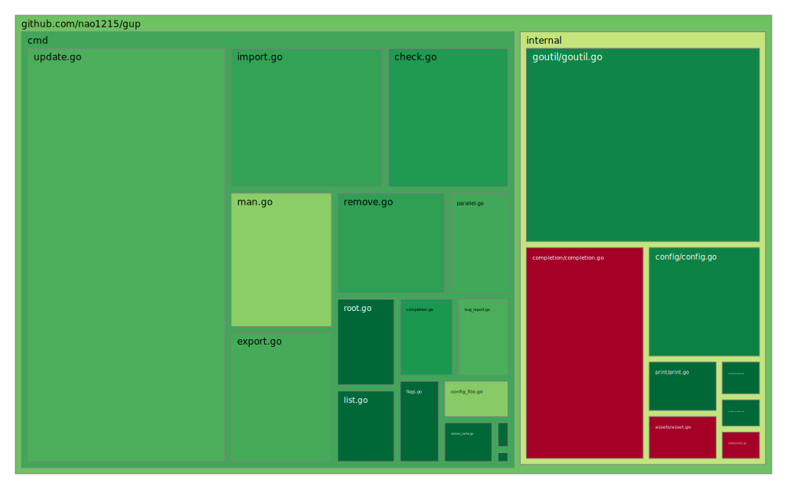

## Contributing to gup
Thank you for building gup with us.
Every report, patch, test, and review directly improves the daily workflow of Go developers.
Let's keep gup fast, safe, and reliable together.

## Contributing as a Developer
### 1. Start with clear communication
- Bug report: Use the issue template and include reproducible steps, expected behavior, and actual behavior.
- New feature: Open an issue first so we can agree on direction before implementation.
- Bug fix or improvement: Open a PR with a clear problem statement and solution summary.

### 2. Keep the quality bar high
- Add or update unit tests when you add features or fix bugs.
- Avoid regressions on supported OSes (Linux, macOS, Windows).
- Keep CLI behavior and error messages clear and consistent.

### 3. Run checks before opening a PR
```shell
make test
make vet
make fmt
make coverage-tree
```

`coverage-tree` generates the test treemap shown below.



### 4. Manage developer tools with Go tool declarations
gup manages helper tools via `go.mod` `tool` entries.
Use the command below to add or update tool dependencies:

```shell
make update-tools
```

## Contributing Outside of Coding
You can still make a huge impact even if you are not writing code:

- Give gup a GitHub Star
- Share gup with your team and community
- Open issues with clear reproduction steps
- Sponsor the project
